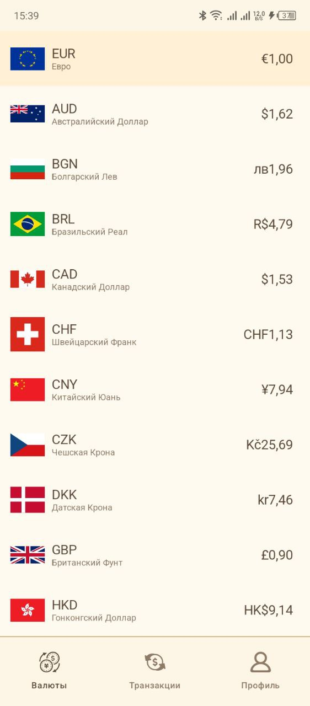
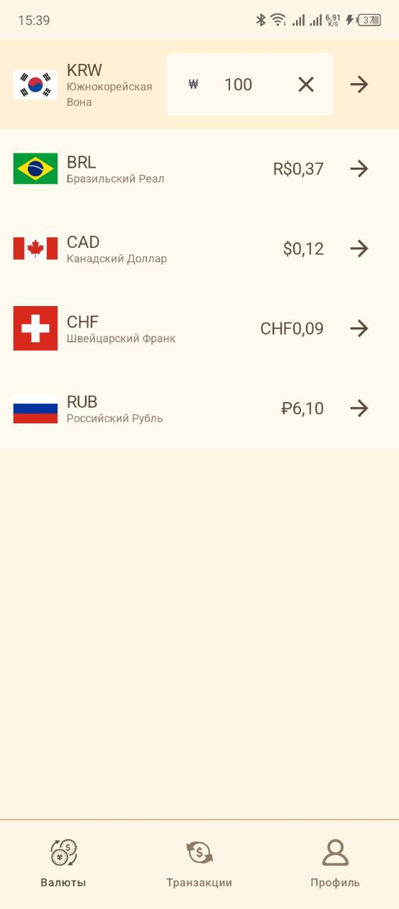
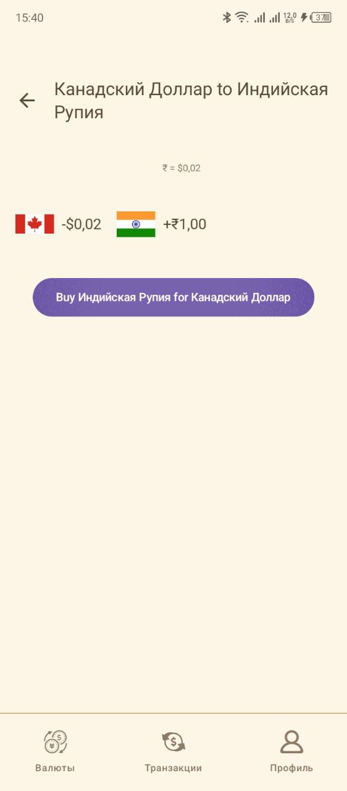
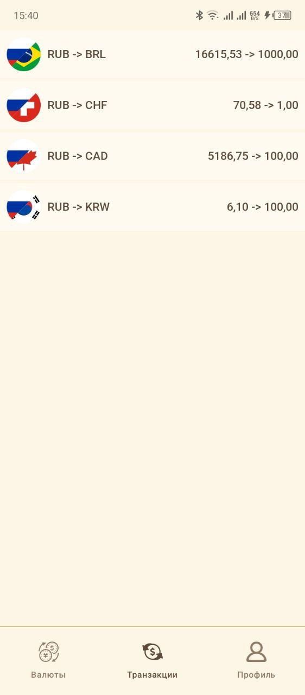
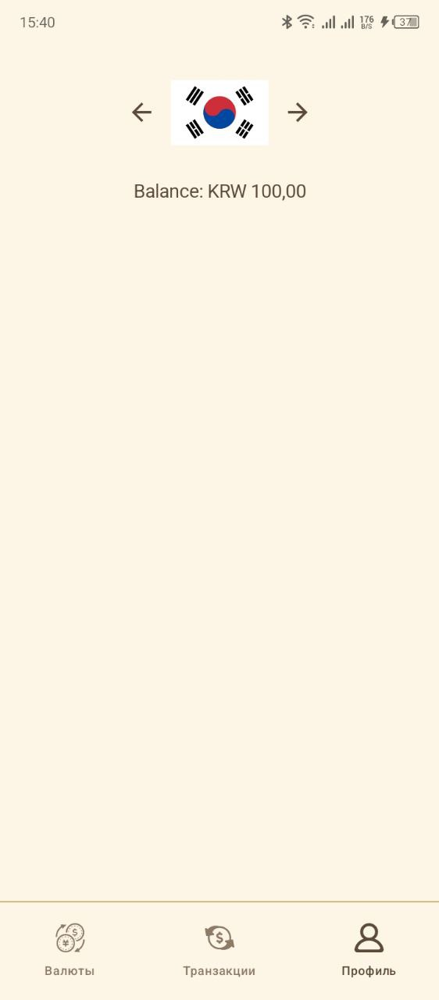
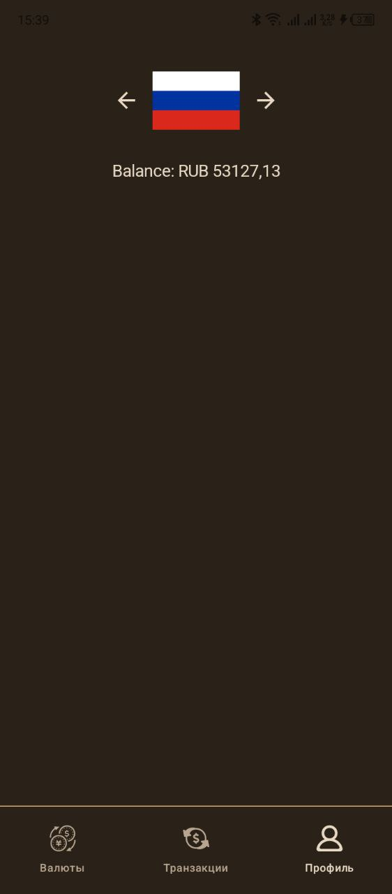

# Currency Converter

## Оглавление
- [Описание](#описание)
- [Структура и особенности кода](#структура-и-особенности-кода)
- [Скриншоты](#скриншоты)
- [Используемые технологии](#используемые-технологии)
- [Установка](#установка)
- [Портфолио](#портфолио)

## Описание
**Currency Converter — приложение для конвертации валют, выполненное как тестовое задание для компании [Workmate](https://work-mate.ru/). Оно состоит из трех экранов: "Валюты", "Обмен" и "Транзакции". Приложение позволяет просматривать курсы валют, обменивать валюту с учетом доступных средств на счетах и просматривать историю транзакций.

### Основные функции
1. Анимированный Splash Screen с логотипом Workmate.
2. Экран "Валюты" с возможностью ввода суммы для обмена.
3. Автоматическое обновление курсов валют каждую секунду с использованием метода `getRates` из [RemoteRatesServiceImpl](app/src/main/java/com/example/currencyconverter/home/data/data_source/remote/RemoteRatesServiceImpl.kt).
4. Поддержка кросс-курсов с пересчетом по выбранной валюте.
5. Ввод суммы для обмена с автоматическим пересчетом валют, доступных для покупки.
6. Переход на экран "Обмен" с расчетом суммы для покупки и продажи валюты.
7. Экран "Транзакции", отображающий список всех совершенных транзакций.
8. Поддержка светлой и темной темы.

## Структура и особенности кода
Проект использует паттерн **MVI**. Каждая функциональность оформлена отдельным пакетом (`home`, `profile`, `transaction`) с подпакетами `data`, `domain` и `presentation` по чистой архитектуре.

- **Навигация** построена через `Navigation Compose` и типобезопасные маршруты. Состояния экранов описаны как сериализуемые sealed классы в [`Screens`](app/src/main/java/com/example/currencyconverter/navigation/Screens.kt), а переходы выполняются с помощью расширения [`animatedTransition`](app/src/main/java/com/example/currencyconverter/navigation/animatedTransition.kt).
- **DI** реализовано через **Hilt**. Модули располагаются в пакете [`di`](app/src/main/java/com/example/currencyconverter/di).
- Все строки и ресурсы вынесены в [`strings.xml`](app/src/main/res/values/strings.xml) и обращение к ним происходит через `R.string.*`, что упрощает локализацию (приложение локализировано на английский и русский языки).

## Скриншоты

### Светлая тема

  
  
  
  
  
  

### Темная тема

  
  
  
  
  
  

## Используемые технологии
| Технология                | Описание                                                    |
|---------------------------|-------------------------------------------------------------|
| **Jetpack Compose**       | Построение пользовательского интерфейса и навигации         |
| **Hilt**                  | Внедрение зависимостей                                      |
| **Kotlinx Serialization** | Сериализация аргументов для type‑safe навигации             |
| **Room**                  | Локальная БД для хранения информации о валюте и транзакциях |

## Установка

Ссылка на текущую версию <a href="">Releases</a>

<a href="">Прямая ссылка на установку .zip</a>

<a href="">Прямая ссылка на установку .apk</a>

## Портфолио
Для ознакомления с другими работами автора вы можете посетить портфолио на [Behance](https://www.behance.net/gallery/222004489/Android-Developer-Portfolio).